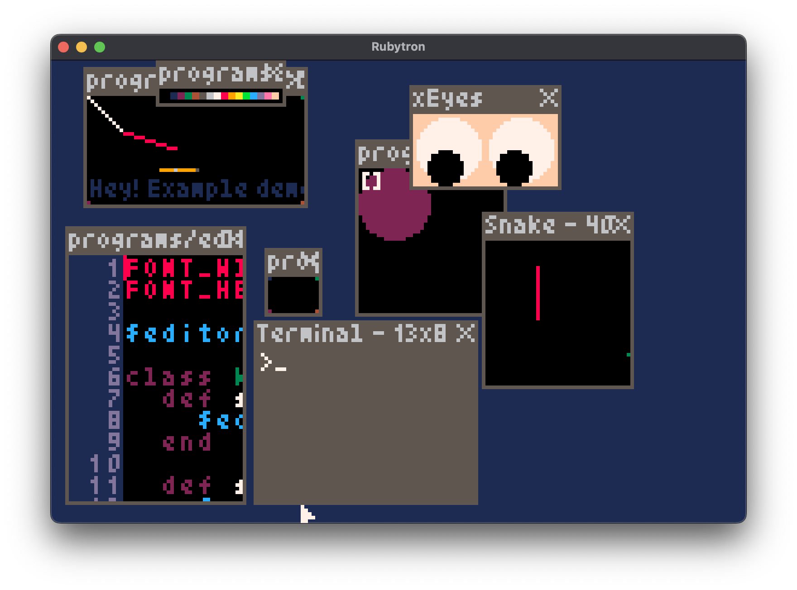

# Rubytron



## :warning: This project is currently work in progress, so do not expect anything working / usefull for now

## Inspiration

Rubytron is based on the desktop experience of (now released) [Picotron](https://www.lexaloffle.com/picotron.php) (Screenshots can be found on the [zep's Twitter](https://twitter.com/lexaloffle), and now on the official website).  
Unlike Picotron, Rubytron use Ruby as scripting language for games/programs.

## Capabilities

Display: 384x240 / 4bits (16 colors)  
Code: mruby 3.4 (2.x ruby)

## Build

```console
$ cp rubytron.rb mruby/build_config/. && cd mruby && MRUBY_CONFIG=rubytron rake && cd ..
[...]
$ meson setup build --prefix="$PWD/dist"
[...]
$ ninja -C build
```

## Export for your plateform

```console
$ meson install -C build
[...]
```

You can then check the `dist` directory

## Run

```console
./build/src/rubytron
```

## Update the macOS icon

```console
$ iconutil -c icns data/rubytron.iconset -o data/rubytron.icns
[...]
```
